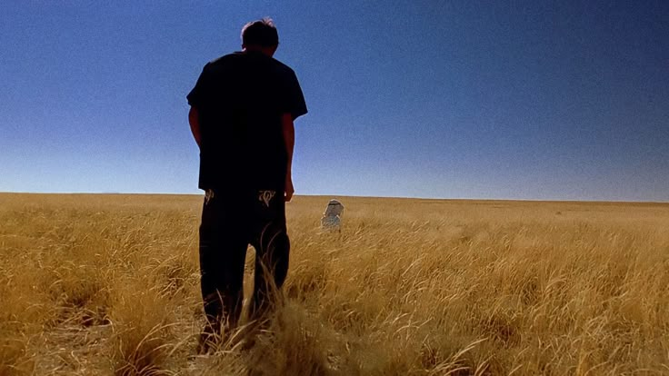
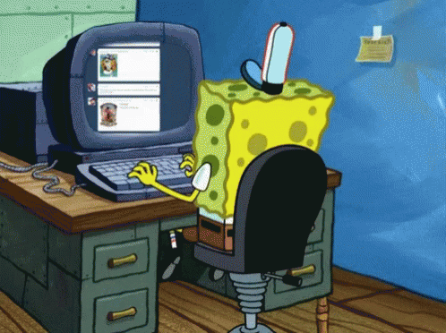

 

---

## 👋 Hey there!

I'm **Andreas**, an Informatics student from Yogyakarta, Indonesia.

I love building things on the web, especially on the backend. Currently exploring how to integrate AI into real-world applications while learning modern web technologies.

**What I'm doing:**
- 🔨 Building full-stack apps with React & Laravel
- 🤖 Experimenting with AI/ML integration
- 📚 Learning system architecture & design patterns
- 🌱 Contributing to open source when I can

 

---

## 🛠 Tech Stack

<table>
<tr>
<td align="center" width="25%">

### 💻 Languages

 

</td>
<td align="center" width="25%">

### 🚀 Frameworks

 

</td>
<td align="center" width="25%">

### 🗄️ Databases

 

</td>
<td align="center" width="25%">

### 🛠️ Tools

 

</td>
</tr>
</table>

---

## 📚 Currently Learning

<table>
<tr>
<td width="35%">

</td>
<td width="65%">

**Deepening my knowledge in:**
- Advanced JavaScript & TypeScript
- React hooks & state management
- Laravel best practices & optimization
- AI/ML fundamentals with Python
- Cloud technologies (AWS, Docker)
- System design & architecture patterns

**Goals for 2026:**
- Contribute more to open source
- Build AI-powered applications
- Master backend architecture
- Deploy production-ready apps

</td>
</tr>
</table>

---

## 📫 Let's Connect!

| 📧 Email | 📸 Instagram | 💼 LinkedIn |
|:--------:|:------------:|:-----------:|
| [andreasandrianto50176@email.com](mailto:Andreasandrianto50176@email.com) | [@noround2](https://www.instagram.com/noround2/) | [Andreas Andrianto](https://www.linkedin.com/in/andreas-andrianto-thegoat/) |

**Open to collaborations, tech discussions, or just saying hi!** 👋

---

*"Hola como esta"* 😄

 

**Thanks for visiting! ⭐**

 

