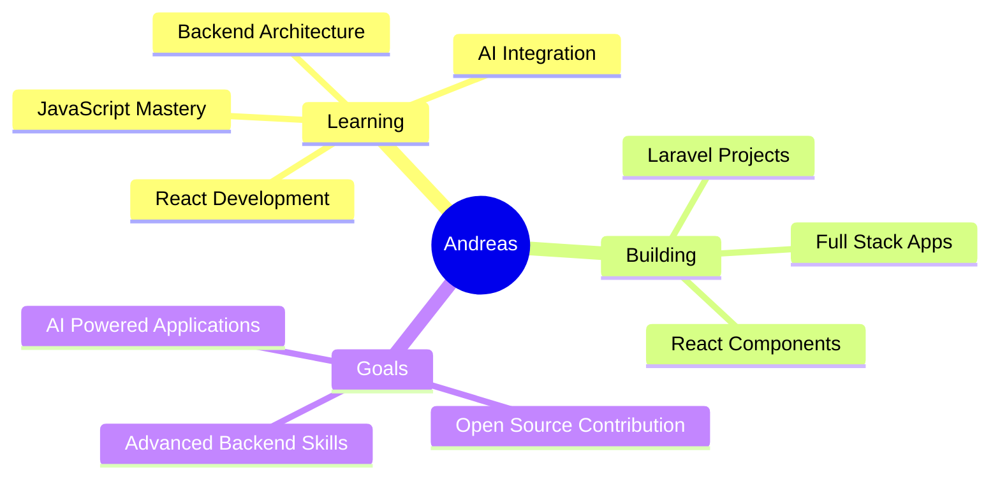

<div align="center">

# 👋 Hello guys, I'm Andreas


<a href="https://www.linkedin.com/in/andreas-andrianto-thegoat/"></a>
<a href="https://www.instagram.com/noround2/"></a>
<a href="mailto:Andreasandrianto50176@email.com"></a>

</div>


## 🚀 About Me

<table>
<tr>
<td width="50%">


</td>
<td width="50%">

```javascript
const andreas = {
    location: "Yogyakarta, Indonesia 🇮🇩",
    education: "Amikom Yogyakarta",
    role: "Informatics Student",
    interests: [
        "Backend Development",
        "AI Integration", 
        "Web Technologies",
        "Problem Solving"
    ],
    currentlyLearning: {
        languages: ["JavaScript", "PHP", "C#"],
        frameworks: ["React", "Laravel"],
        focus: "Backend with AI"
    },
    funFact: "I love backend logic! ⚡"
};
```

</td>
</tr>
</table>


## 🛠️ Tech Arsenal

<div align="center">

### Languages
<p>

</p>

### Frameworks & Libraries
<p>

</p>

### Databases & Tools
<p>

</p>

</div>


## 🎯 What I'm Up To

<div align="center">



</div>


## 💼 Current Focus

<div align="center">

| 🔥 Building | 🤖 Exploring | 📚 Learning | 🌐 Contributing |
|------------|-------------|------------|----------------|
| Full-stack web applications | AI integration in web dev | Backend architecture | Open-source projects |
| React & Laravel projects | Machine learning basics | Advanced JavaScript | Community development |

</div>


## 📬 Let's Connect!

<div align="center">

<table>
<tr>
<td align="center" width="33%">

### 📧 Email
[Andreasandrianto50176@email.com](mailto:Andreasandrianto50176@email.com)

</td>
<td align="center" width="33%">

### 📸 Instagram
[@noround2](https://www.instagram.com/noround2/)

</td>
<td align="center" width="33%">

### 💼 LinkedIn
[Andreas Andrianto](https://www.linkedin.com/in/andreas-andrianto-thegoat/)

</td>
</tr>
</table>

</div>


## 💭 Philosophy

<div align="center">

> **"Hola como esta"** - Andreas probably 😄

<br>

### ⚡ Fun Fact About Me
*I believe that the best code is the code that solves real problems elegantly!*

<br>

**Feel free to reach out if you want to collaborate on projects, discuss tech, or just say hi! 🚀**

<br>


<br>

**Made with ❤️ by Andreas**

⭐️ *If you like my work, consider giving my repos a star!* ⭐️

</div>


