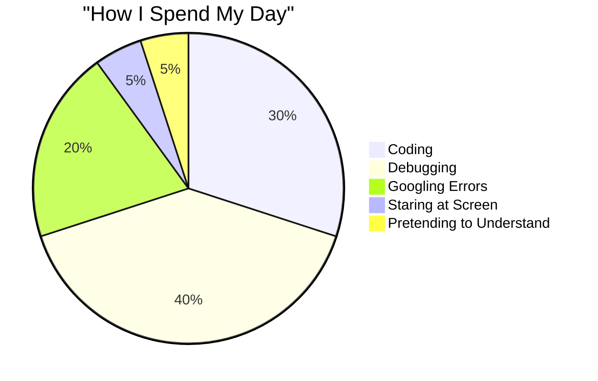

<div align="center">

<!-- Epic Header -->


<h1>
  
</h1>


<br><br>

<!-- Status Badges -->


<br><br>

<!-- Social Links -->
<a href="https://www.linkedin.com/in/andreas-andrianto-thegoat/">
  
</a>
<a href="https://www.instagram.com/noround2/">
  
</a>
<a href="mailto:Andreasandrianto50176@email.com">
  
</a>

<br>


</div>

<br>


<br>

##  Who Am I? (The Real Question)

<table>
<tr>
<td width="60%" valign="top">

### 📝 The Official Bio

```javascript
class Andreas extends Developer {
  constructor() {
    super();
    this.location = "Yogyakarta, Indonesia 🇮🇩";
    this.education = "Amikom Yogyakarta";
    this.role = "Informatics Student";
    this.status = "Turning ☕ into </> since 2020";
  }

  getCurrentActivities() {
    return [
      "🔥 Building full-stack apps (and breaking them)",
      "🤖 Teaching AI to be my rubber duck",
      "📚 Learning React (and crying)",
      "🐛 Creating bugs... I mean features",
      "💤 Dreaming in JavaScript"
    ];
  }

  getSkillLevel(skill) {
    const skills = {
      "Coding": "Advanced 💪",
      "Googling": "Expert 🔍",
      "Copy-Paste": "Master 🎓",
      "Debugging": "Legendary 🦸",
      "Coffee Making": "Godlike ☕"
    };
    return skills[skill];
  }
}

const me = new Andreas();
console.log(me.getCurrentActivities());
// Output: *existential crisis noises* 🙃
```

</td>
<td width="40%" align="center" valign="top">

### 😤 When Code Doesn't Work


<br><br>

### 😄 When It Finally Works!


</td>
</tr>
</table>

<br>


<br>

##  My Arsenal (aka My Survival Kit)

<div align="center">

### 💻 Languages I Speak (Besides Sarcasm)


### 🚀 Frameworks & Libraries (My Best Friends)


### 🗄️ Databases (Where I Store My Regrets)


### 🛠️ Tools (That Save My Life Daily)


</div>

<br>


<br>

##  Current Mission: Operation Debug Life

<div align="center">

<table width="100%">
<tr>
<td width="50%" align="center">

### 🎯 What I'm Building


```yaml
Projects:
  - "Full-stack apps that actually work (sometimes)"
  - "APIs that don't return 500 errors (hopefully)"
  - "UIs that look good (according to my mom)"
  - "Code that future me won't curse at"
```

</td>
<td width="50%" align="center">

### 📚 What I'm Learning


```yaml
Currently Grinding:
  - "JavaScript (still confusing after 3 years)"
  - "React hooks (useEffect is my nemesis)"
  - "Backend magic with Laravel"
  - "AI stuff (teaching robots to code for me)"
```

</td>
</tr>
</table>

</div>

<br>


<br>

##  My Daily Routine (The Sad Truth)

<div align="center">



<br>

### ⚡ Developer Life Cycle

```
☕ Coffee → 💻 Code → 🐛 Bug → 😭 Cry → 🔍 Google → 💡 Solution → 
😤 More Bugs → 😱 Panic → 🍕 Food → 💤 Sleep (optional) → Repeat ∞
```

</div>

<br>


<br>

##  Let's Connect! (I Don't Bite... Much)

<div align="center">

<table>
<tr>
<td align="center" width="33%">

<br><br>
<b>📧 Email</b>
<br>
<sub>For business inquiries<br>(or cat memes)</sub>
<br><br>
<a href="mailto:Andreasandrianto50176@email.com">Andreasandrianto50176@email.com</a>
</td>

<td align="center" width="33%">

<br><br>
<b>📸 Instagram</b>
<br>
<sub>Where I pretend to have<br>a life outside coding</sub>
<br><br>
<a href="https://www.instagram.com/noround2/">@noround2</a>
</td>

<td align="center" width="33%">

<br><br>
<b>💼 LinkedIn</b>
<br>
<sub>Professional mode:<br>activated</sub>
<br><br>
<a href="https://www.linkedin.com/in/andreas-andrianto-thegoat/">Andreas Andrianto</a>
</td>
</tr>
</table>

</div>

<br>


<br>

##  Fun Facts & Random Stuff

<div align="center">

### 💭 My Philosophy

> **"Hola como esta"** 🌮
> 
> *- Andreas, probably high on caffeine*

<br>

### 🎮 Achievement Unlocked

<table>
<tr>
<td align="center">

<br>
<b>Bug Master</b>
<br>
<sub>Created 1000+ bugs</sub>
</td>
<td align="center">

<br>
<b>Coffee Addict</b>
<br>
<sub>Consumed 9999L coffee</sub>
</td>
<td align="center">

<br>
<b>Stack Overflow Hero</b>
<br>
<sub>Asked same question 100x</sub>
</td>
<td align="center">

<br>
<b>Night Owl</b>
<br>
<sub>Sleep is for the weak</sub>
</td>
</tr>
</table>

<br>

### 📊 My Programming Stats

```
Lines of Code Written: Too many to count 📝
Bugs Fixed: Some of them 🐛
Bugs Created: All of them 💀
Coffee Consumed: Not enough ☕
Hours of Sleep: What's sleep? 😴
Sanity Level: 404 Not Found 🤪
```

<br>

### 🎯 Life Goals

- [ ] Write code that works on first try
- [ ] Understand CSS centering
- [ ] Stop googling "how to exit vim"
- [ ] Remember what I coded yesterday
- [x] Convince myself I'm a good developer

<br>

### ⚠️ Warning Label

```
⚠️ CAUTION: May randomly talk about:
• Why my code doesn't work
• How I fixed a bug at 3 AM
• The superiority of dark mode
• Why semicolons are optional (they're not)
• Coffee brands and their caffeine content
```

</div>

<br>


<br>

<div align="center">

## 🌟 Thanks for Stopping By!


<br>

**If you made it this far, you're officially awesome! 🎉**

*Feel free to reach out if you want to:*
- 🤝 Collaborate on projects
- 💬 Talk about tech (or memes)
- ☕ Share coffee recommendations
- 🐛 Debug life together

<br>

### Remember: We're all just Googling our way through life! 😂

<br>


<br><br>

**⭐ Don't forget to star my repos if you find them helpful!**

*(Or if you feel bad for me)*

</div>

<br>

<!-- Epic Footer -->

